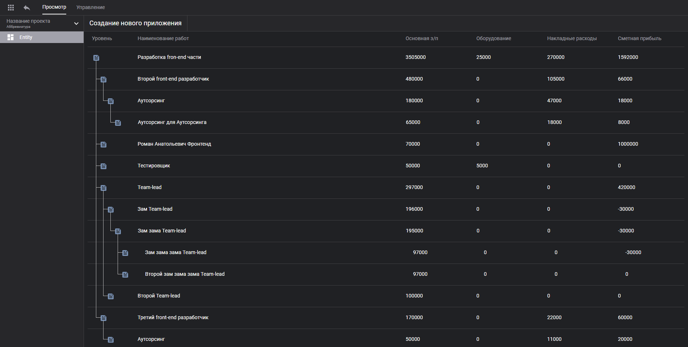
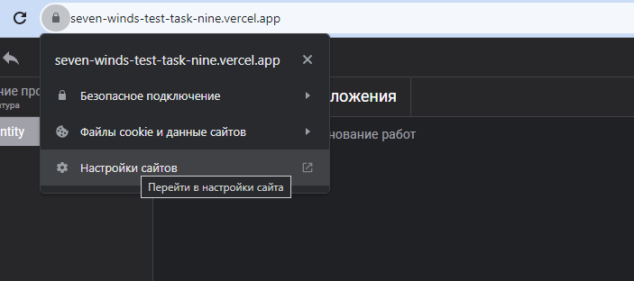
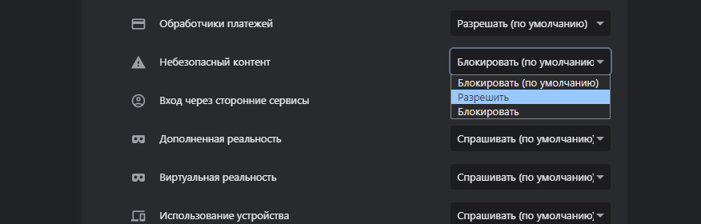
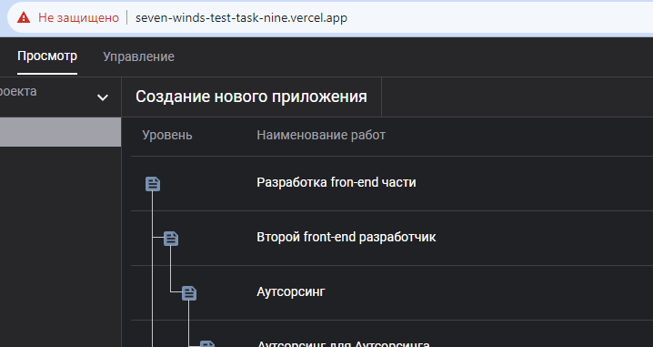

# Тестовое задание

*взаимодействие с API, построение дерева элементов*



*развёрнут на Платформе Versel:*
## https://seven-winds-test-task-nine.vercel.app

Внимание! 
API данных в проекте, не имеет сертификат SSL, а Versel не позволяет использовать http соединение, следовательно возникает ошибка Mixed content и получать данные невозможно.
Что бы исправить это, можно отключить блокировку для этого сайта у себя в браузере Chrome:

- Нажать на кнопку адресной строки

- Выбрать 'разрешить' небезопасный контент

-

# Описание 
Сайт представляет из себя отображение дерева затрат для сущности, id которой является константой
- если дерева изначально нет, отображается строка редактирования
- нажатие на иконку слева строки создаёт новую строку в текущем уровне
- двойное нажатие на строку включает режим редактирования
- для отправки данных пр исоздании или редактировании строки необходимо нажать 'Enter'
- кнопка удаления строки появляется при наведении на иконку слева от строки
- при любом создании, изменении или удалении строки происходит редактирование данных дерева с учётом изменений в колонках с числовыми значениями

# Информация разработки
- cайт написан на библиотеке **`React`** c использованием **`TypeScript`**
- cобран с помощью **`Vite`**
- применяется библиотека **`RTK-Query`** - для отправки запросов, кеширования и управления состоянием выборки
- развёрнут на платформе **`Versel`**

### Технологии: 
 - используются функциональные компоненты
 - нет повторных запросов на обновление данных, при каждом изменении

*описание работы функций можно найти в коментариях кода*

# Запустить локально

1. Клонировать репозиторий
```
git clone https://github.com/RemixFX/seven-winds-test-task.git
```
2. Перейти в папку проекта, установить зависимости
```
npm install
```
3. Запустить проект
```
npm run preview
```
___


